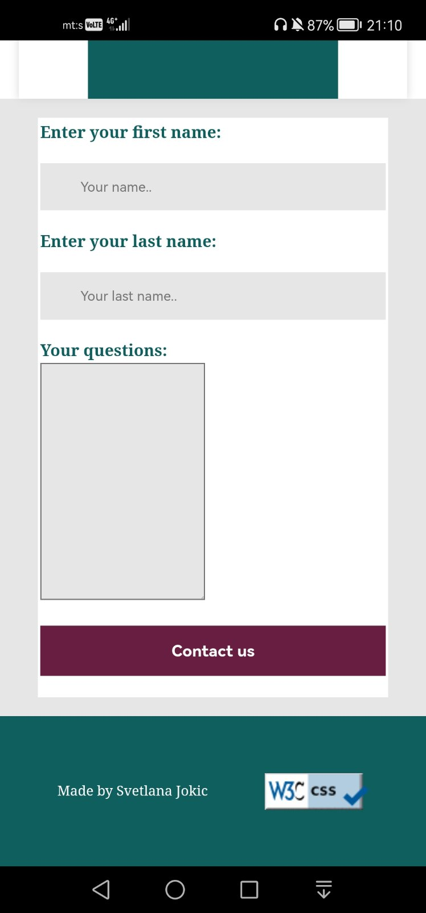
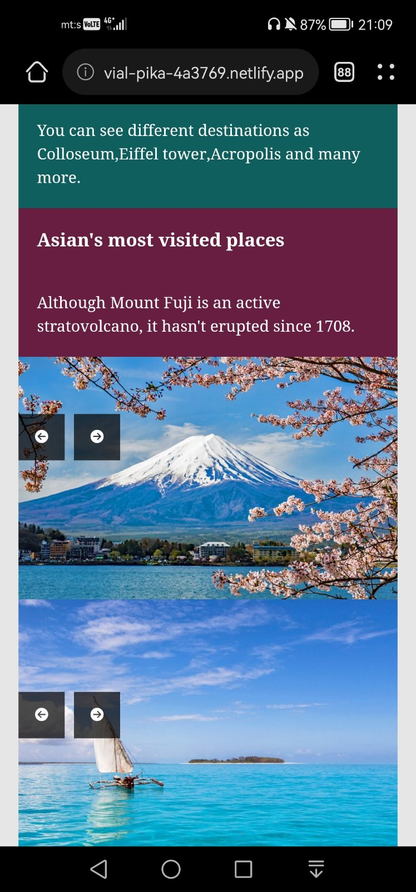

# coursera-final-travel

This is a project from the course I am currently taking Web Design for Everybody, University of Michigan.
You can fnd this amazing course on this [link](https://www.coursera.org/learn/web-design-project).

## Table of contents

- [Overview](#overview)
  - [Screenshot](#screenshot)
  - [Links](#links)
- [My process](#my-process)
  - [Built with](#built-with)
  - [What I learned](#what-i-learned)
- [Author](#author)

## Overview

This project is built with HTML5, CSS3 and JavaScript.

### Screenshot







### Links

- Live Site URL: [from netlify](https://jovial-pika-4a3769.netlify.app/)

## My process

First of all I used one [website](https://templatemo.com) for the idea how can I make good looking website. After I choose one of a lot of there, I started to write HTML. It was really hard at the beggining, because I didnt know from where to start. So I started with this:

```html
<body>
  <header>
    <div class="header-container container">
      <button class="nav-toggle" aria-label="open navigation">
        <span class="hamburger"></span>
      </button>
      <a class="logo" href="#"
        >
      </a>
      <span class="logo-title">JOURNEY</span>

      <nav class="nav">
        <ul class="nav-list">
          <li class="nav-item"><a href="#home" class="nav-link">Home</a></li>
          <li class="nav-item">
            <a href="#top" class="nav-link">Top Destinations</a>
          </li>
          <li class="nav-item">
            <a href="#places" class="nav-link">Recommended Places</a>
          </li>
          <li class="nav-item">
            <a href="#contact" class="nav-link">Contact Us</a>
          </li>
        </ul>
      </nav>
    </div>
  </header>
</body>
```

Here I just made my navigation bar, and i included lists for accessibility.
After this I decided to move to a content, where I made sections. And connected sections with my navigation links. So when user press on my navigation bar it will navigate him to go to different sections. My first section includes: background image, what I did with CSS, and with html, i just added one image with three dots. Also I included one button on the middle , so when user press will move to form. Form has place to write destination, where I used placeholder, than few inputs to check rooms, with select what has option tag.
And in the end has submit button.
Later on I am going to explain how I did style with CSS.

```html
<section id="home" class="background-image section-container section-one">
  <h1 class="section-title white">LET'S BEGIN</h1>
  <div class="image-points">
    
  </div>
  <p class="section-text white">We assist you to choose the best!</p>
  <div class="btn-parent">
    <button class="btn-circle">
      <i class="fa-solid fa-angle-down"></i>
      <span class="visually-hidden"
        >Check it here what kinda offers we have for ya</span
      >
    </button>
  </div>
  <form class="form">
    <div class="destination">
      <label for="inputCity">Choose Your Destination</label>
      <input
        name="destination"
        type="text"
        class="dest-first form-control"
        id="inputCity"
        placeholder="Type your destination..."
      />
    </div>
    <div class="room">
      <label for="inputRoom">How many rooms?</label><br />
      <select name="room" class="form-control tm-select" id="inputRoom">
        <option value="1" selected>1 Room</option>
        <option value="2">2 Rooms</option>
        <option value="3">3 Rooms</option>
    </div>
    <div class="adult">
      <label for="inputAdult">Adult</label> <br />
      <select name="adult" class="form-control" id="inputAdult">
        <option value="1" selected>1</option>
        <option value="2">2</option>
      </select>
    </div>
    <div class="children">
      <label for="inputChildren">Children</label><br />
      <select name="children" class="form-control" id="inputChildren">
        <option value="0" selected>0</option>
        <option value="1">1</option>
        <option value="2">2</option>
      </select>
    </div>
    <div class="checkIn">
      <label for="inputCheckIn">Check In Date</label>
      <input
        name="check-in"
        type="text"
        class="form-control"
        id="inputCheckIn"
        placeholder="Check In"
      />
    </div>
    <div class="checkOut">
      <label for="inputCheckOut">Check Out Date</label>
      <input
        name="check-out"
        type="text"
        class="form-control"
        id="inputCheckOut"
        placeholder="Check Out"
      />
    </div>
    <div class="submit">
      <input
        type="submit"
        value="Check Availability"
        class="btn-submit"
        id="btnSubmit"
      />
    </div>
  </form>
</section>
```

```html
<aside class="aside">
  <h2 class="aside-heading">Your Jorney is our priority</h2>
  <p class="aside-description">
    We have a lot of offers so be sure to check all our offers
  </p>
  <a href="#" class="aside-btn"> Explore more</a>
</aside>
```

I have aside included, just for better design and good looking. My second section consists of sliders. I am using lists  for accessibility. I also included buttons on three divs, 2 for left and right side, so later with javascript i will make it clickable and to be able to change pictures on click. I used font awesome icons for left and right arrows. There are three divs, which consist of img,h3,p. Later on I'll explain how i styled with CSS. I needed to provide for screen readers text for buttons and labels, and on some places i used css and html together to be visually hidden.

```html
<section id="top" class="slider-wrapper section-two">
      <div class="slider-first">
        <ul class="slides-container slider" id="slides-container">
          <li class="figure-first slide">
            
          </li>
          <li class="figure-first slide">
            
          </li>
          <li class="figure-first slide">
            
          </li>
        </ul>
        <button
          class="slide-arrow btn-left"
          aria-hidden="true"
          id="slide-arrow-prev"
        >
          <i class="fa-solid fa-circle-arrow-left"></i>
          <span class="visually-hidden">Button left</span>
        </button>

        <button
          class="slide-arrow btn-right"
          aria-hidden="true"
          id="slide-arrow-next"
        >
          <i class="fa-solid fa-circle-arrow-right"> </i>
          <span class="visually-hidden">Button right</span>
        </button>
        <div class="parent-box-blue">
          <h3>Europe's most visited places</h3>
          <p>
            You can see different destinations as Colloseum,Eiffel
            tower,Acropolis and many more.
          </p>
        </div>
      </div>
      <div class="second-slider">
        <div class="parent-box-pink">
          <h3>Asian's most visited places</h3>
          <p>
            Although Mount Fuji is an active stratovolcano, it hasn't erupted
            since 1708.
          </p>
        </div>
        <ul class="slides-container-second" id="slides-container-second">
          <li class="figure-first slide-two">
            
          </li>
          <li class="figure-first slide-two">
            
          </li>
          <li class="figure-first slide-two">
            
          </li>
        </ul>
        <button
          class="btn-left-pink btn-left-second"
          aria-hidden="true"
          id="slide-arrow-second"
        >
          <i class="fa-solid fa-circle-arrow-left"></i>
          <span class="visually-hidden">Button left</span>
        </button>

        <button
          class="slide-arrow-second btn-right-pink btn-right-second"
          aria-hidden="true"
          id="slide-arrow-next-second"
        >
          <i class="fa-solid fa-circle-arrow-right"></i>
          <span class="visually-hidden">Button right</span>
        </button>
      </div>

      <div class="slider-third">
        <ul class="slides-container-third" id="slides-container-third">
          <li class="figure-first slide-three">
            
          </li>
          <li class="figure-first slide-three">
            
          </li>
          <li class="figure-first slide-three">
            
          </li>
        </ul>

        <button
          class="btn-left-third"
          id="slide-arrow-third"
          aria-hidden="true"
        >
          <i class="fa-solid fa-circle-arrow-left"></i>
          <span class="visually-hidden">Button left</span>
        </button>

        <button class="btn-right-third" id="slide-arrow-next-third">
          <i class="fa-solid fa-circle-arrow-right"></i>
          <span class="visually-hidden">Button right</span>
        </button>
        <div class="parent-blue-box-third">
          <h3>Africa's most visited places</h3>
          <p>
            One of the most beloved destinations in Africa, like Cairo,Cape Town
            and Zanzibar.
          </p>
        </div>
      </div>
    </section>
```

At the third section i have list with small images where I used css to make it all ok.. With 3 divs after it, which include h3,p,img. And later on, with JavaSript on click will change all that images when be clicked on continent.

```html
    <section id="places" class="section-three">
      <ul class="continents">
        <li class="cont-li">
          <a href="#1" class="cont-link antarctica"
            >Antartica</a
          >
        </li>
        <li class="cont-li">
          <a href="#2" class="cont-link asia"
            >Asia</a
          >
        </li>
        <li class="cont-li">
          <a href="#3" class="cont-link north-america"
            >North America</a
          >
        </li>
        <li class="cont-li">
          <a href="#4" class="cont-link europe"
            >Europe</a
          >
        </li>
        <li class="cont-li">
          <a href="#5" class="cont-link australia"
            >Australia</a
          >
        </li>
        <li class="cont-li">
          <a href="#6" class="cont-link south-america"
            >South America</a
          >
        </li>
        <li class="cont-li">
          <a href="#7" class="cont-link africa"
            >Africa</a
          >
        </li>
      </ul>
      <div class="parent-prices">
        <div class="hotel-prices first-hotel">
          
          <div class="mid-text mid-text-first">
            <h3 class="hotel-name hotel-name-first">Sheraton Rhodes</h3>
            <p class="hotel-location hotel-location-first">Ixia</p>
            <p class="hotel-description hotel-description-first">
              Book now to spend amazing days in Ixia.
            </p>
          </div>
          <div class="right-prices right-prices-first">
            <p class="price price-first">330$</p>
          </div>
        </div>

        <div class="hotel-prices second-hotel">
          
          <div class="mid-text mid-text-second">
            <h3 class="hotel-name hotel-name-second">Hard Rock Hotel</h3>
            <p class="hotel-location hotel-location-second">Madrid</p>
            <p class="hotel-description hotel-description-second">
              Book now to spend amazing days in Madrid.
            </p>
          </div>
          <div class="right-prices right-prices-second">
            <p class="price price-second">250$</p>
          </div>
        </div>
        <div class="hotel-prices third-hotel">
          
          <div class="mid-text mid-text-third">
            <h3 class="hotel-name hotel-name-third">Icehotel</h3>
            <p class="hotel-location hotel-location-third">Sweeden</p>
            <p class="hotel-description hotel-description-third">
              Book now to spend amazing days in Sweeden.
            </p>
          </div>
          <div class="right-prices right-prices-third">
            <p class="price price-third">450$</p>
          </div>
        </div>
      </div>
    </section>
```

In the last section is form what is just contact form, with submit button.

```html
<section id="contact" class="form-contact">

    <form action="" class="form-contact-s">

      <label for="fname"></label>
      <input type="text" id="fname" name="firstname" placeholder="Your name..">

      <label for="lname"></label>
      <input type="text" id="lname" name="lastname" placeholder="Your last name..">
      <label for="subject"></label>
      <textarea id="subject" name="subject" placeholder="Write something.." style="height:200px">
          </textarea>
      <input type="submit" value="Contact us" class="form-submit">
    </form>
        <p> Made by Svetlana Jokic</p>
  </footer>
  <script src="./js/index.js"></script>
</body>

</html>
```

There is footer, for accessibility, later in CSS ill explain styles.
I started writing CSS with CSS reset, the most popular one, what is recommended from Kevin Powell in one of his videos.
I added the most used colors in all project, and for all elements box-sizing: border-box, to have all together in box, so I can easier manipulate with margins,paddings.
For images i put default 100% and display block.
My container class is max-width of 85rem, which i found it as a best practice for well looking website, with padding n margin inline. Webkit,ms are browser prefixes to be supported on this browsers. Also visually-hidden is class which helped me to hide description of labels and buttons where I needed for web accessibility. In body, i put line-height and font-size. But later on I was adjusting, depends of needs. Most of the CSS colors are from root , so I used var with () , and style like it. I found it, much easier and faster way to write colors, so I didnt need every time to check which color I need.

```CSS
:root {
  --blue: #007bff;
  --pink: #671e40;
  --green: rgb(15, 95, 95);
  --lightgreen: #20c997;
  --white: #fff;
  --gray: #868e96;
  --gray-dark: #343a40;
  --black: #000;
  --grey: #e6e6e6;

}
*,
*::before,
*::after {
  box-sizing: border-box;
  padding: 0;
  margin: 0;
}

img {
  max-width: 100%;
  display: block;
}

.container {
  max-width: 85rem;
  padding-inline: 2em;
  margin-inline: auto;
}

html {
  font-family: sans-serif;
  line-height: 1.15;
  -webkit-text-size-adjust: 100%;
  -ms-text-size-adjust: 100%;
  -ms-overflow-style: scrollbar;
}

.visually-hidden:not(:focus):not(:active) {
  clip: rect(0 0 0 0);
  clip-path: inset(100%);
  height: 1px;
  overflow: hidden;
  position: absolute;
  white-space: nowrap;
  width: 1px;
}

body {
  line-height: 1.5;
  font-size: 1rem;
  font-family: Cambria, Cochin, Georgia, Times, 'Times New Roman', serif;
  font-weight: 400;
  background: var(--grey);
  color: var(--white);
}
```

After it, i started writing for header and navigation bar. I wrote first for phone. I used flexbox. For hamburger, for small size devices I used javascript on click.

```css
.background-image {
  background-image: linear-gradient(rgba(0, 0, 0, 0.527), rgba(0, 0, 0, 0.5)),
    url("../images/banner.jpg");
  background-repeat: no-repeat;
  background-size: cover;
  background-position: center;
  min-height: 700px;
  background-color: rgb(0, 0, 0, 0.7);
}

.image-points {
  display: flex;
  justify-content: center;
  align-items: center;
}
```

Background image was very challenging for me. I couldnt get shadow on the image. So after I done some research I wrote linear-gradienr with two rgba,and background color with opacity on it.  
First form, was hard to make at first. I didnt know what to use. Should I start with tables, or use CSS. So I done some research and I used CSS Grid. For mobile view, was easy, but for desktop view was much harder, but I was able to manage it . So I will include code for desktop view for form. I included box shadow here, because looks better to me. And max-width of 70%.

```css
/* Form Desktop view*/ 
@media (min-width:800px) {
  .form {
    display: grid;
    gap: 1rem;
    grid-template-columns: repeat(5, 1fr);
    max-width: 70%;
    padding: 1rem;
    box-shadow: 0px 0px 7px 0px rgb(214 214 214);
  }

  .destination {
    grid-column: span 2;
  }

  .room {
    grid-column: span 1;
    width: 100%;
  }

  .adult {
    grid-column: span 1;
  }

  .children {
    grid-column: span 1;
  }

  .checkIn {
    grid-column: span 1;
  }

  .checkOut {
    grid-column: span 1;
  }

  .submit {
    grid-column: span 3;
    align-self: end;
  }
}
```

Most of the time I am using rem, or em units, but sometimes I used % and avoid to use px because is an absolute unit. Another interesting challenge was buttons on the pictures. What is different for phones and for large screen devices. I used positions, z-index, with and height where i needed fixed for my buttons.

```css
.btn-left {
  position: absolute;
  z-index: 1;
  height: 40px;
  width: 40px;
  background: rgba(0, 0, 0, 0.7);
  color: var(--white);
  border: none;
  margin-top: -200px;
}

.btn-right {
  z-index: 1;
  height: 40px;
  width: 40px;
  background: rgba(0, 0, 0, 0.7);
  border: none;
  color: var(--white);
  position: absolute;
  margin-top: -200px;
  margin-left: 3rem;
}
```

For continents I made class and used flexbox, with space-between and flex wrap wrap, so to make it more accessible on small screen later on.
Last section is one div which includes one picture, h3 and p. Also I made them to be separated, on the left side is picture, middle is text and description, and on the right side is price of it. On right side, I included one background image whhat is curve and giving well looking to this section, prices and all.

I used media queries for 3 views: mobile, tablet and dekstop view. I got problem, when I wanted to make all accessible. So I used for tablet view min-width and max-width, just for tablet, so I didnt have problem later on with anything.

I want to make still animation, on header, and one button.

For JavaScript part , Ive done first for hamburger on click. I just connected all n make variables. 
```js
const navToggle = document.querySelector('.nav-toggle');
const nav = document.querySelector('.nav');
navToggle.addEventListener('click', () => {

    nav.classList.toggle('nav--visible');
})
```
After that I moved on buttons, left and right for second section, where I made it clickable, and to change images. 
```js
const slidesContainer = document.getElementById("slides-container");
const slide = document.querySelector(".slide");
const prevButton = document.getElementById("slide-arrow-prev");
const nextButton = document.getElementById("slide-arrow-next");
 
nextButton.addEventListener("click", () => {
  const slideWidth = slide.clientWidth;
  slidesContainer.scrollLeft += slideWidth;
});
 
prevButton.addEventListener("click", () => {
  const slideWidth = slide.clientWidth;
  slidesContainer.scrollLeft -= slideWidth;
});
```
So when clicked move and show images. I used clientWidth. So when we click on right or left button gonna change images. 
And for the last part where I used JavaScript, I used also on click event. I needed to connect one continent with all text what I prepared, what is in another 3 containers. 
```js
const antarctica=document.querySelector(".antarctica");
const asia=document.querySelector(".asia");
const northAmerica=document.querySelector(".north-america");
const europe=document.querySelector(".europe");
const australia=document.querySelector(".australia");
const southAmerica=document.querySelector(".south-america");
const africa=document.querySelector(".africa");
const container=document.querySelector(".parent-prices");
const hotelImgFirst=document.querySelector(".first-hotel-img")
const midTextFirst=document.querySelector('.mid-text-first')
const hotelNameFirst=document.querySelector('.hotel-name-first')
const hotelLocationFirst=document.querySelector('.hotel-location-first')
const hotelDescriptionFirst=document.querySelector('.hotel-description-first')
const priceFirst=document.querySelector('.price-first')

//add event listener to continents

africa.addEventListener('click', function(){
  //first image
  hotelNameFirst.innerText="La Mamounia Hotel "
hotelLocationFirst.innerHTML="Marakesh"
hotelDescriptionFirst.innerHTML="Book now to spend amazing days in Marakesh."
priceFirst.innerHTML="220$"
hotelImgFirst.src="./images/lamamonia.jfif"
//second image
hotelNameSecond.innerText="Sofitel Cairo"
hotelLocationSecond.innerHTML="Cairo"
hotelDescriptionSecond.innerHTML="Book now to spend amazing days in Cairo"
priceSecond.innerHTML="120$"
hotelImgSecond.src="./images/sofitel-cairo.jfif"
//third image
hotelNameThird.innerText="Ol Jogi"
hotelLocationThird.innerHTML="Il polei"
hotelDescriptionThird.innerHTML="Book now to spend amazing days in Kenya";
priceThird.innerHTML="310$";
hotelImgThird.src="./images/kenya.jfif"
})
```
So this is how I connected all. So every time when we click on one of the continents will give us different pictures and different text. 


### Built with 

- Semantic HTML5 markup
- CSS3 (flexbox, grid)
- JavaScript

### What I learned
I learned how to actually connect all together and make something what actually working. Of course we need to always practice more and more, to be better in everything. 

## Author

- Website - [Svetlana Jokic](https://my-portfolio-hollyy.netlify.app/)
- Frontend Mentor - [@Holllyyyy](https://www.frontendmentor.io/profile/Holllyyyy)
- Twitter - [@svetlanajokic](https://twitter.com/svetlanajokic)
- LinkedIn - [@Svetlana Jokic](https://www.linkedin.com/in/svetlana-jokic-787432100/)
